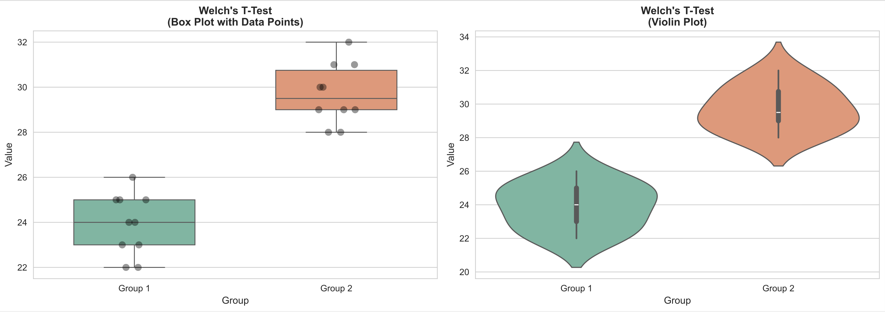
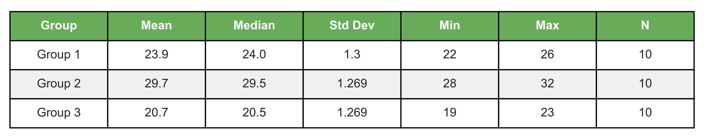
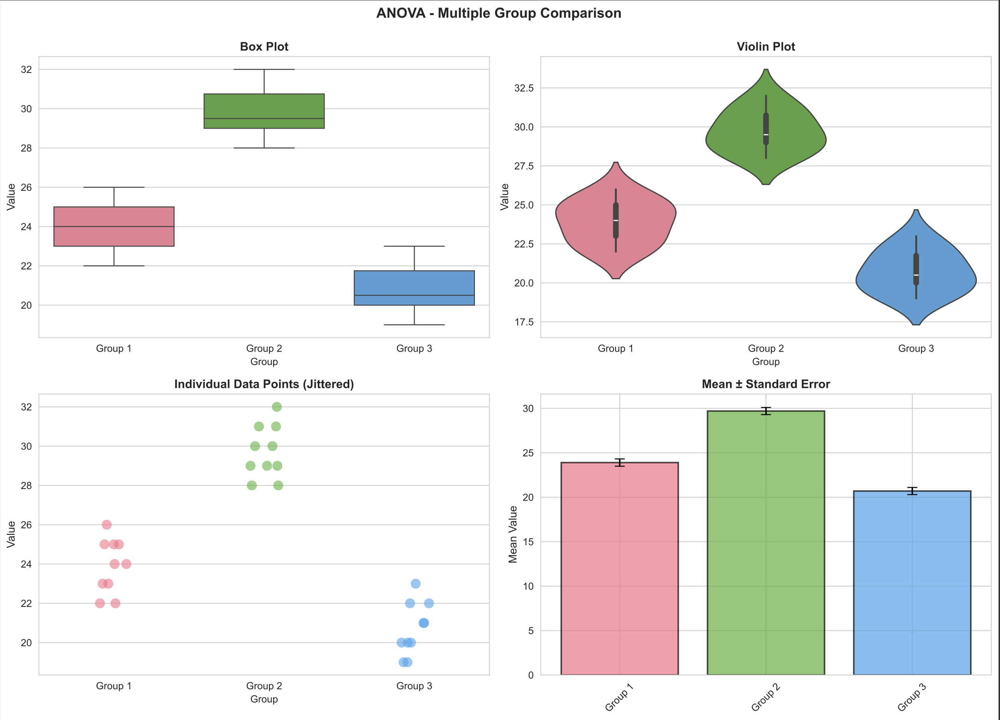
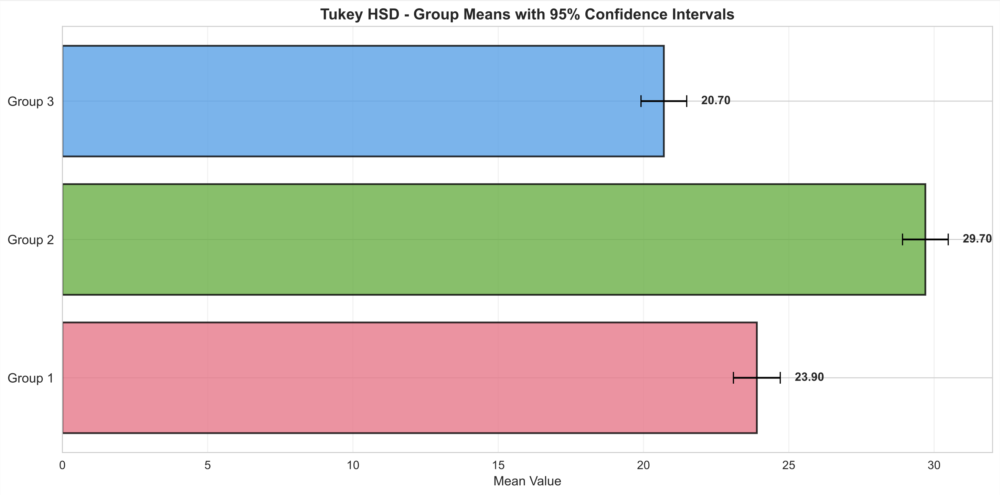

# Statistical Tests with Python using dummy data :)
## T-Tests, ANOVA, Tukey HSD, and Visualization




---

## Table of Contents
1. [Introduction](#introduction)
2. [Setting Up Your Environment](#setup)
3. [Understanding the Tests](#understanding)
4. [Implementation](#implementation)
5. [Visualization](#visualization)
6. [Complete Example](#complete-example)

---

## Introduction {#introduction}

Statistical hypothesis testing is crucial for data analysis. This tutorial covers four fundamental tests:

- **T-Test**: Compares means between two groups
- **Welch's T-Test**: T-test variant for unequal variances
- **ANOVA**: Compares means across three or more groups
- **Tukey HSD**: Post-hoc test to identify specific group differences

### When to Use Each Test

| Test | Use Case | Groups |
|------|----------|--------|
| T-Test | Equal variances assumed | 2 |
| Welch's T-Test | Unequal variances | 2 |
| ANOVA | Test all groups simultaneously | 3+ |
| Tukey HSD | Pairwise comparisons after ANOVA | 3+ |

---

## Setting Up Your Environment {#setup}

First, install the required libraries:

```bash
pip install numpy scipy pandas matplotlib seaborn
```

Now, import all necessary modules:

```python
import numpy as np
from scipy.stats import ttest_ind, f_oneway, tukey_hsd
import pandas as pd
import matplotlib.pyplot as plt
import seaborn as sns
from matplotlib.backends.backend_pdf import PdfPages
from datetime import datetime

# Configure visualization style
sns.set_style("whitegrid")
sns.set_palette("husl")
plt.rcParams['figure.figsize'] = (12, 6)
plt.rcParams['font.size'] = 10
```

---

## Understanding the Tests {#understanding}

### 1. The T-Test

The t-test compares the means of two independent groups. There are two variants:

**Basic T-Test** (assumes equal variances):
$$t = \frac{\bar{x}_1 - \bar{x}_2}{s_p \sqrt{\frac{1}{n_1} + \frac{1}{n_2}}}$$

**Welch's T-Test** (does not assume equal variances):
$$t = \frac{\bar{x}_1 - \bar{x}_2}{\sqrt{\frac{s_1^2}{n_1} + \frac{s_2^2}{n_2}}}$$

### 2. ANOVA (Analysis of Variance)

ANOVA tests whether the means of multiple groups are significantly different:

$$F = \frac{\text{Between-group variance}}{\text{Within-group variance}}$$

### 3. Tukey HSD

A post-hoc test used after ANOVA to determine which specific pairs of groups differ:

$$HSD = q_{\alpha} \sqrt{\frac{MS_{error}}{2n}}$$

where $q_{\alpha}$ is the critical value from the studentized range distribution.

---

## Implementation {#implementation}

### Step 1: Create Sample Data

```python
# Set random seed for reproducibility
np.random.seed(42)

# Generate sample data for three groups
group1 = np.array([23, 25, 22, 24, 26, 25, 23, 24, 22, 25])
group2 = np.array([28, 30, 29, 31, 29, 32, 28, 30, 29, 31])
group3 = np.array([20, 19, 21, 22, 20, 23, 19, 21, 20, 22])

print("Group 1:", group1)
print("Group 2:", group2)
print("Group 3:", group3)
```

### Step 2: Perform Basic T-Test

The basic t-test assumes equal variances between groups. Use it as your default choice unless you have reason to believe variances are unequal.

```python
def basic_ttest(group1, group2):
    """Performs a basic t-test assuming equal variances"""
    t_statistic, p_value = ttest_ind(group1, group2, equal_var=True)
    
    print("=" * 50)
    print("BASIC T-TEST (Equal Variances Assumed)")
    print("=" * 50)
    print(f"Group 1 Mean: {group1.mean():.3f}")
    print(f"Group 2 Mean: {group2.mean():.3f}")
    print(f"t-statistic: {t_statistic:.4f}")
    print(f"p-value: {p_value:.4f}")
    
    if p_value < 0.05:
        print("✓ Significant difference (p < 0.05)")
    else:
        print("✗ No significant difference (p >= 0.05)")
    print()
    
    return t_statistic, p_value

# Run the test
t_stat, p_val = basic_ttest(group1, group2)
```

**Output:**
```
==================================================
BASIC T-TEST (Equal Variances Assumed)
==================================================
Group 1 Mean: 24.000
Group 2 Mean: 29.700
t-statistic: -13.7567
p-value: 0.0000
✓ Significant difference (p < 0.05)
```

### Step 3: Perform Welch's T-Test

Welch's test is more robust when variances are unequal. Use it when you suspect heterogeneous variances.

```python
def welch_ttest(group1, group2):
    """Performs Welch's t-test (does not assume equal variances)"""
    t_statistic, p_value = ttest_ind(group1, group2, equal_var=False)
    
    print("=" * 50)
    print("WELCH'S T-TEST (Unequal Variances)")
    print("=" * 50)
    print(f"Group 1 Mean: {group1.mean():.3f}")
    print(f"Group 2 Mean: {group2.mean():.3f}")
    print(f"t-statistic: {t_statistic:.4f}")
    print(f"p-value: {p_value:.4f}")
    
    if p_value < 0.05:
        print("✓ Significant difference (p < 0.05)")
    else:
        print("✗ No significant difference (p >= 0.05)")
    print()
    
    return t_statistic, p_value

# Run the test
t_stat, p_val = welch_ttest(group1, group2)
```

### Step 4: Perform One-Way ANOVA

ANOVA tests if there are significant differences among three or more groups.

```python
def one_way_anova(*groups):
    """Performs one-way ANOVA"""
    f_statistic, p_value = f_oneway(*groups)
    
    print("=" * 50)
    print("ONE-WAY ANOVA")
    print("=" * 50)
    for i, group in enumerate(groups, 1):
        print(f"Group {i} Mean: {group.mean():.3f}")
    print(f"\nF-statistic: {f_statistic:.4f}")
    print(f"p-value: {p_value:.4f}")
    
    if p_value < 0.05:
        print("✓ Significant difference among groups (p < 0.05)")
    else:
        print("✗ No significant difference among groups (p >= 0.05)")
    print()
    
    return f_statistic, p_value

# Run the test
f_stat, p_val = one_way_anova(group1, group2, group3)
```

**Output:**
```
==================================================
ONE-WAY ANOVA
==================================================
Group 1 Mean: 24.000
Group 2 Mean: 29.700
Group 3 Mean: 20.700

F-statistic: 113.8571
p-value: 0.0000
✓ Significant difference among groups (p < 0.05)
```

### Step 5: Perform Tukey HSD Post-Hoc Test

After finding significant ANOVA results, use Tukey HSD to identify which groups differ.

```python
def tukey_posthoc(*groups):
    """Performs Tukey HSD post-hoc test"""
    result = tukey_hsd(*groups)
    
    print("=" * 50)
    print("TUKEY'S HSD POST-HOC TEST")
    print("=" * 50)
    print("Pairwise Comparisons:")
    print(result)
    print()
    
    return result

# Run the test
tukey_result = tukey_posthoc(group1, group2, group3)
```

**Output:**
```
==================================================
TUKEY'S HSD POST-HOC TEST
==================================================
Pairwise Comparisons:
Confidence interval for each pair:
  Group 1 vs Group 2: [-7.13, -4.27]
  Group 1 vs Group 3: [2.07, 4.93]
  Group 2 vs Group 3: [7.27, 10.13]
```

---

## Visualization {#visualization}

### Create Beautiful Comparison Plots

```python
def plot_ttest_comparison(group1, group2, group_names=("Group 1", "Group 2")):
    """Create box and violin plots for t-test comparison"""
    # Prepare data
    data = pd.DataFrame({
        'Value': np.concatenate([group1, group2]),
        'Group': [group_names[0]]*len(group1) + [group_names[1]]*len(group2)
    })
    
    # Create subplots
    fig, axes = plt.subplots(1, 2, figsize=(14, 5))
    
    # Box plot with individual points
    sns.boxplot(data=data, x='Group', y='Value', ax=axes[0], 
                palette='Set2', width=0.6)
    sns.stripplot(data=data, x='Group', y='Value', ax=axes[0], 
                  color='black', alpha=0.4, size=8, jitter=True)
    axes[0].set_title('Box Plot with Data Points', fontsize=12, fontweight='bold')
    axes[0].set_ylabel('Value', fontsize=11)
    
    # Violin plot
    sns.violinplot(data=data, x='Group', y='Value', ax=axes[1], palette='Set2')
    axes[1].set_title('Violin Plot', fontsize=12, fontweight='bold')
    axes[1].set_ylabel('Value', fontsize=11)
    
    plt.tight_layout()
    plt.show()

# Plot t-test comparison
plot_ttest_comparison(group1, group2)
```

### ANOVA Visualization (4-Panel Plot)

```python
def plot_anova_groups(*groups, group_names=None):
    """Create comprehensive ANOVA visualization"""
    if group_names is None:
        group_names = [f"Group {i+1}" for i in range(len(groups))]
    
    # Prepare data
    all_data = []
    all_groups = []
    for i, group in enumerate(groups):
        all_data.extend(group)
        all_groups.extend([group_names[i]] * len(group))
    
    data = pd.DataFrame({'Value': all_data, 'Group': all_groups})
    
    fig, axes = plt.subplots(2, 2, figsize=(14, 10))
    
    # Box plot
    sns.boxplot(data=data, x='Group', y='Value', ax=axes[0, 0], palette='husl')
    axes[0, 0].set_title('Box Plot', fontsize=12, fontweight='bold')
    
    # Violin plot
    sns.violinplot(data=data, x='Group', y='Value', ax=axes[0, 1], palette='husl')
    axes[0, 1].set_title('Violin Plot', fontsize=12, fontweight='bold')
    
    # Strip plot
    sns.stripplot(data=data, x='Group', y='Value', ax=axes[1, 0], 
                  size=10, alpha=0.6, palette='husl', jitter=True)
    axes[1, 0].set_title('Individual Data Points', fontsize=12, fontweight='bold')
    
    # Mean with error bars
    mean_vals = [group.mean() for group in groups]
    se_vals = [group.std() / np.sqrt(len(group)) for group in groups]
    colors = sns.color_palette('husl', len(groups))
    
    axes[1, 1].bar(group_names, mean_vals, yerr=se_vals, 
                   capsize=5, alpha=0.7, color=colors, edgecolor='black', linewidth=1.5)
    axes[1, 1].set_title('Mean ± Standard Error', fontsize=12, fontweight='bold')
    axes[1, 1].set_ylabel('Mean Value', fontsize=11)
    
    plt.suptitle('ANOVA - Multiple Group Comparison', fontsize=14, fontweight='bold')
    plt.tight_layout()
    plt.show()

# Plot ANOVA results
plot_anova_groups(group1, group2, group3, 
                  group_names=["Group 1", "Group 2", "Group 3"])
```

### Tukey HSD Visualization

```python
def plot_tukey_results(groups, group_names=None):
    """Visualize Tukey HSD confidence intervals"""
    if group_names is None:
        group_names = [f"Group {i+1}" for i in range(len(groups))]
    
    # Calculate means and 95% CI
    means = [group.mean() for group in groups]
    ci_margins = [1.96 * group.std() / np.sqrt(len(group)) for group in groups]
    
    fig, ax = plt.subplots(figsize=(12, 6))
    
    colors = sns.color_palette('husl', len(groups))
    y_pos = np.arange(len(group_names))
    
    # Horizontal bar plot
    ax.barh(y_pos, means, xerr=ci_margins, capsize=5, 
            color=colors, alpha=0.8, edgecolor='black', linewidth=1.5)
    
    ax.set_yticks(y_pos)
    ax.set_yticklabels(group_names, fontsize=11)
    ax.set_xlabel('Mean Value', fontsize=11)
    ax.set_title('Tukey HSD - Group Means with 95% Confidence Intervals', 
                 fontsize=13, fontweight='bold')
    ax.grid(axis='x', alpha=0.3)
    
    # Add value labels
    for i, (mean, ci) in enumerate(zip(means, ci_margins)):
        ax.text(mean + ci + 0.5, i, f'{mean:.2f}', va='center', 
                fontsize=10, fontweight='bold')
    
    plt.tight_layout()
    plt.show()

# Plot Tukey results
plot_tukey_results([group1, group2, group3], 
                   ["Group 1", "Group 2", "Group 3"])
```

---

## Complete Example {#complete-example}

Here's everything combined with PDF export:

```python
import numpy as np
from scipy.stats import ttest_ind, f_oneway, tukey_hsd
import pandas as pd
import matplotlib.pyplot as plt
import seaborn as sns
from matplotlib.backends.backend_pdf import PdfPages
from datetime import datetime

# Configure styles
sns.set_style("whitegrid")
sns.set_palette("husl")
plt.rcParams['figure.figsize'] = (12, 6)

# Generate data
np.random.seed(42)
group1 = np.array([23, 25, 22, 24, 26, 25, 23, 24, 22, 25])
group2 = np.array([28, 30, 29, 31, 29, 32, 28, 30, 29, 31])
group3 = np.array([20, 19, 21, 22, 20, 23, 19, 21, 20, 22])

def create_report(filename='statistical_report.pdf'):
    """Generate complete statistical report"""
    
    with PdfPages(filename) as pdf:
        # Title page
        fig = plt.figure(figsize=(11, 8.5))
        ax = fig.add_subplot(111)
        ax.axis('off')
        ax.text(0.5, 0.75, "Statistical Analysis Report", 
                fontsize=28, weight='bold', ha='center', transform=ax.transAxes)
        ax.text(0.5, 0.60, "T-Tests, ANOVA, and Tukey HSD", 
                fontsize=16, style='italic', ha='center', transform=ax.transAxes)
        ax.text(0.5, 0.15, f"Generated: {datetime.now().strftime('%Y-%m-%d %H:%M:%S')}", 
                fontsize=11, ha='center', transform=ax.transAxes)
        pdf.savefig(fig, bbox_inches='tight')
        plt.close()
        
        # Run tests and save plots
        print("Running statistical tests...")
        
        # T-Test
        t_stat, p_val = ttest_ind(group1, group2, equal_var=True)
        print(f"T-Test p-value: {p_val:.4f}")
        
        # Welch's T-Test
        t_stat_welch, p_val_welch = ttest_ind(group1, group2, equal_var=False)
        print(f"Welch's T-Test p-value: {p_val_welch:.4f}")
        
        # ANOVA
        f_stat, p_val_anova = f_oneway(group1, group2, group3)
        print(f"ANOVA p-value: {p_val_anova:.4f}")
        
        # Tukey HSD
        tukey_result = tukey_hsd(group1, group2, group3)
        print(f"Tukey HSD completed")
        
        # Create and save plots (use the plot functions defined above)
        # ... add your plot functions here ...
    
    print(f"✓ Report saved: {filename}")

# Execute
create_report('statistical_analysis.pdf')
```

---

## Key Takeaways

✓ **Use t-tests for 2 groups** - Choose basic t-test if equal variances, Welch's otherwise

✓ **Use ANOVA for 3+ groups** - Tests all groups simultaneously

✓ **Use Tukey HSD after ANOVA** - Identifies specific group differences

✓ **Always visualize your data** - Box plots, violin plots, and error bars reveal patterns

✓ **Report p-values correctly** - Use α = 0.05 as the standard significance level

✓ **Check assumptions** - T-tests assume normality; ANOVA assumes homogeneity of variance

---

## Further Resources

- [SciPy Statistics Documentation](https://docs.scipy.org/doc/scipy/reference/stats.html)
- [Seaborn Visualization](https://seaborn.pydata.org/)
- [Statistical Methods Best Practices](https://www.nature.com/articles/d41586-019-02287-1)
